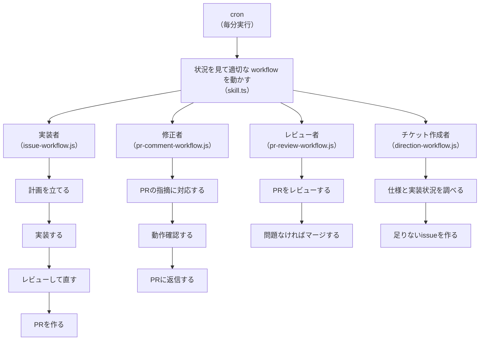

# Claude Code の Workflow（Dynamic Workflows）とは

公式ドキュメント: <https://code.claude.com/docs/en/workflows>

## 一言でいうと

Workflow は、複数のサブエージェントをオーケストレーションするためのスクリプト

## メリット

- 複数エージェントを起動できる
- 流れを定型化できる（再利用・再実行できる）
- バックグラウンドで実行されるので、セッション自体は操作可能

## 個人的な感想

- コード上で schema を定義して結果の型を固定できるので、AIの出力がぶれにくい
- JS なので日本語の指示文より読む気になる（AIが書く・直すものなのであまり関係ないかも、、）

## 主なAPI

- `agent(prompt, opts?)` — サブエージェントを起動

  ```javascript
  const result = await agent('src/routes/ 配下の .ts ファイル一覧を返して')
  ```

- `parallel(thunks)` — 複数タスクを同時実行し、全て揃うまで待つ。同じ処理を複数件に一括で流すだけのとき

  ```javascript
  await parallel([
    () => agent('a.ts を直して'),
    () => agent('b.ts を直して'),
    () => agent('c.ts を直して'),
  ])
  ```

- `pipeline(items, ...stages)` — `items` から1件ずつ取り出し、その1件が `stages` を順に通る
  恩恵が出るのは items が複数あるときだけ  
  items が1件しかないなら素の `await agent(...)` を並べるのと結果は同じなので、`pipeline([item], ...)` にする必要はない  

  ```javascript
  await pipeline(
    files,
    file => agent(`${file} の問題点を調査して`),                    // 1段目: 調査結果(findings)を返す
    (findings, file) => agent(`${file} を次の内容で修正して: ${findings}`), // 2段目: 前段の結果 と 元のfile を両方使う
  )
  ```

- `phase(title)` — 進捗表示上のグループ分け

  ```javascript
  phase('監査')
  ```

## 制約

- 実行中に追加入力は受け付けない
    - ステージごとに承認を挟みたい場合は workflow を分割 or skill で作成
- スクリプトから直接 `Skill()` は呼べない
    - `agent()` のプロンプトで「〇〇スキルを実行して」と指示
    - skill を実行させる sub agent を用意しておき、その　agent を起動させる
- 同時実行は最大16件

## 注意点

- 通常の会話より多くのエージェントを起動するため、トークン消費が大きくなりがち

## CronCreate（定期実行）

Workflow を定期的に起動する仕組み。cron式（5フィールド、ローカル時間）で `prompt` を指定時刻ごとに再投入する

- セッション限りで、ディスクには保存されない（Claude Codeを再起動すると消える）
- `recurring: true`（既定）で繰り返し、`false` なら次回1回だけ実行して自動削除
- 繰り返しジョブは登録から7日で自動的に失効する（最後に1回だけ発火してから削除される）
- 発火するのは REPL がアイドルな時のみ（クエリ実行中は待たされる）

`auto-dev` の `skill.ts` はこれを使い、未登録なら「毎分このスキルを実行して」という cron を自分で作成する。7日で失効するため、セッションが長引く場合は再登録が必要になる

## 例

issue の作成から実装・レビュー・マージまで、役割ごとに分かれた workflow が AI だけで自走する

- チケット作成者: `direction-workflow.js`  
    仕様と実装状況から次の issue を作成  
- 実装者: `issue-workflow.js`  
    issue を計画 -> 実装 -> レビュー -> PR作成まで対応  
- 修正者: `pr-comment-workflow.js`  
    PR についた指摘コメントに対応  
- レビュー者: `pr-review-workflow.js`  
    PR をレビューし、問題なければマージ  

skill.ts（状態管理・workflow の管理を行う）

- cron 登録確認  
    - 未登録なら、毎分 workflow を実行する cron を作成  
- 状態読み込み  
    - 実行中タスクがまだ動いているか確認  
- 起動判定  
    - 上限に達していなければ、比率が一番不足している type を選ぶ  
- workflow 起動  
    - auto-dev → issue か PR コメント対応を1件選び、worktree を用意して起動  
    - pr-review → 自分の open PR を1件選び、worktree を用意して起動  
    - direction → そのまま起動  

issue-workflow.js（skill.ts が選んだ issue 1件を処理する）  
├── 計画立案  
│   ├── `plan-issue` に issue URL を渡し実装計画を作成  
│   └── 中止判定なら終了  
├── ブランチ作成  
│   ├── `git-branch-name` で計画からブランチ名を決定  
│   └── skill.ts が起動時に渡した worktree でブランチ切り替え  
├── 実装  
│   └── `implement` に計画を渡して worktree 内で実装  
├── レビュー・E2E検証（最大 maxIterations 回）  
│   ├── `review-diff`（静的レビュー）と `test-e2e`（動作確認）を並列実行  
│   ├── 指摘があれば `implement` で修正 → 再検証  
│   └── 上限到達でも clean にならなければ、既知の指摘として PR に記載したうえで次へ進む  
└── commit・PR作成  
    ├── `git-commit-message` でメッセージ生成  
    ├── commit  
    ├── push  
    ├── `git-pr-draft` で PR文面を作成  
    └── PR作成  

pr-comment-workflow.js（skill.ts が選んだ PR 1 件を処理する）  
└── PR対応  
    ├── `git-pr-resolve-comments` に PR URL を渡し指摘に対応  
    ├── `test-e2e` で対応内容を動作確認  
    ├── `git-commit-message` でメッセージ生成  
    ├── commit  
    ├── push  
    └── PR に対応内容を返信  

pr-review-workflow.js（skill.ts が選んだ open PR 1件をレビューする）  
├── 状態確認  
│   ├── レビュースレッドの resolved 状況を確認  
│   └── 未解決の指摘があれば、最新コミットが対応できているか確認し、できていればスレッドを resolve  
├── コードレビュー（コメントが元々無い場合のみ）  
│   └── `review-diff` でコードレビューし、clean なら次へ、指摘があれば PR に返信して終了  
└── マージ（すべて解決済みの場合のみ）  
    ├── gh pr merge を試行し、実際に MERGED になったか確認  
    ├── コンフリクトなら base を取り込んで解消しリトライ  
    ├── マージできたら worktree を削除  
    └── それでも解消できなければ PR にその旨を返信  

direction-workflow.js（毎回1件、次の issue を作成する）  
├── 仕様・現状把握  
│   ├── `research` で仕様を要求・機能ごとの項目一覧に分解  
│   └── 既存の issue 一覧を取得  
├── 次のissue選定（優先順位順、見つかった時点で以降は調査しない）  
│   ├── `find-spec-gaps` で仕様項目と既存 issue を比較し、まだ issue 化されていない項目を探す  
│   ├── 見つからなければ `find-spec-gaps` で仕様項目と実装状況（コードベース）を比較し、足りない部分を探す  
│   └── それでも見つからなければ open PR を確認し、コンフリクトしている PR があれば解消issueを提案する  
└── issue作成  
    ├── 不足項目一覧から issue 候補（title・description・rationale・priority）を生成  
    └── `issue-create` で作成・アサイン  

上のフローを1枚にまとめたもの:


